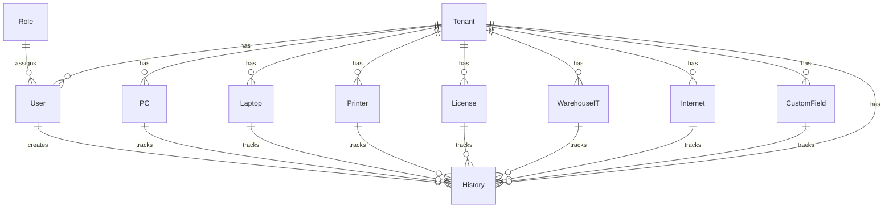

# Database Schema

This document describes the database schema for the IT Asset Management System (ITAMS). The schema is designed with multi-tenancy in mind, featuring complete data isolation between tenants.

## Overview

The database uses PostgreSQL 17 with Prisma ORM for type-safe database access. The schema is defined in `prisma/schema.prisma` and includes the following main entities:

- **Tenant** - Organization/container for all data with complete isolation
- **User** - System users with role-based access and authentication
- **Role** - User roles with configurable permissions
- **PC** - Desktop computer assets with component tracking
- **Laptop** - Portable computer assets with warranty information
- **Printer** - Printing device assets with network details
- **License** - Software license assets with expiration tracking
- **WarehouseIT** - Storage inventory assets with barcode management
- **Internet** - Internet connection assets with access control
- **CustomField** - Tenant-specific custom fields for extensibility
- **History** - Audit trail for all changes with detailed logging

## Entity Relationships



## Detailed Schema

### Tenant

The Tenant entity represents an organization using the system. All other entities are associated with a tenant for complete data isolation.

```prisma
model Tenant {
  id          String    @id @default(uuid())
  name        String
  description String?
  users       User[]
  pcs         PC[]
  laptops     Laptop[]
  printers    Printer[]
  licenses    License[]
  warehouseIT WarehouseIT[]
  internets   Internet[]
  customFields CustomField[]
  histories   History[]
  createdAt   DateTime  @default(now())
  updatedAt   DateTime  @updatedAt
}
```

### User

The User entity represents system users with authentication and authorization information.

```prisma
model User {
  id        String   @id @default(uuid())
  email     String   @unique
  password  String
  name      String
  tenantId  String
  tenant    Tenant   @relation(fields: [tenantId], references: [id])
  roleId    String
  role      Role     @relation(fields: [roleId], references: [id])
  histories History[]
  createdAt DateTime @default(now())
  updatedAt DateTime @updatedAt

  @@index([tenantId])
  @@index([email])
}
```

### Role

The Role entity defines user roles with configurable permissions.

```prisma
model Role {
  id          String   @id @default(uuid())
  name        String   @unique
  description String?
  permissions Json?
  users       User[]
  createdAt   DateTime @default(now())
  updatedAt   DateTime @updatedAt
}
```

### PC

The PC entity tracks desktop computer assets with detailed specifications.

```prisma
model PC {
  id           String   @id @default(uuid())
  tenantId     String
  tenant       Tenant   @relation(fields: [tenantId], references: [id])
  dept         String?
  pcName       String
  status       String
  userName     String?
  cpuBarcode   String?
  note         String?
  customFields Json?
  histories    History[]
  createdAt    DateTime @default(now())
  updatedAt    DateTime @updatedAt

  @@index([tenantId])
  @@index([status])
  @@index([userName])
  @@index([dept])
  @@index([createdAt])
}
```

### Laptop

The Laptop entity manages portable devices with warranty and purchase information.

```prisma
model Laptop {
  id           String   @id @default(uuid())
  tenantId     String
  tenant       Tenant   @relation(fields: [tenantId], references: [id])
  dept         String?
  pcName       String
  status       String
  userName     String?
  brand        String?
  model        String?
  serialNumber String?
  dateBuy      DateTime?
  warranty     String?
  note         String?
  customFields Json?
  histories    History[]
  createdAt    DateTime @default(now())
  updatedAt    DateTime @updatedAt

  @@index([tenantId])
  @@index([status])
  @@index([userName])
  @@index([dept])
  @@index([createdAt])
  @@index([dateBuy])
}
```

### Printer

The Printer entity monitors printers and multifunction devices with network details.

```prisma
model Printer {
  id           String   @id @default(uuid())
  tenantId     String
  tenant       Tenant   @relation(fields: [tenantId], references: [id])
  dept         String?
  printerName  String
  brand        String?
  model        String?
  serialNumber String?
  status       String
  userName     String?
  ipAddress    String?
  macAddress   String?
  note         String?
  customFields Json?
  histories    History[]
  createdAt    DateTime @default(now())
  updatedAt    DateTime @updatedAt

  @@index([tenantId])
  @@index([status])
  @@index([userName])
  @@index([dept])
  @@index([createdAt])
}
```

### License

The License entity tracks software licenses and compliance with expiration dates.

```prisma
model License {
  id            String   @id @default(uuid())
  tenantId      String
  tenant        Tenant   @relation(fields: [tenantId], references: [id])
  dept          String?
  softwareName  String
  productType   String?
  productKey    String?
  licenseType   String?
  updateStatus  String?
  userName      String?
  note          String?
  customFields  Json?
  histories     History[]
  createdAt     DateTime @default(now())
  updatedAt     DateTime @updatedAt

  @@index([tenantId])
  @@index([updateStatus])
  @@index([userName])
  @@index([dept])
  @@index([createdAt])
  @@index([productType])
}
```

### WarehouseIT

The WarehouseIT entity manages inventory in storage with barcode tracking.

```prisma
model WarehouseIT {
  id           String   @id @default(uuid())
  tenantId     String
  tenant       Tenant   @relation(fields: [tenantId], references: [id])
  item         String
  brand        String?
  model        String?
  serialNumber String?
  barcode      String?
  status       String
  quantity     Int
  unit         String?
  note         String?
  customFields Json?
  histories    History[]
  createdAt    DateTime @default(now())
  updatedAt    DateTime @updatedAt

  @@index([tenantId])
  @@index([status])
  @@index([createdAt])
}
```

### Internet

The Internet entity tracks internet connections and access permissions.

```prisma
model Internet {
  id           String   @id @default(uuid())
  tenantId     String
  tenant       Tenant   @relation(fields: [tenantId], references: [id])
  dept         String?
  account      String
  provider     String?
  speed        String?
  status       String
  userName     String?
  ipAddress    String?
  note         String?
  customFields Json?
  histories    History[]
  createdAt    DateTime @default(now())
  updatedAt    DateTime @updatedAt

  @@index([tenantId])
  @@index([status])
  @@index([userName])
  @@index([dept])
  @@index([createdAt])
}
```

### CustomField

The CustomField entity allows tenants to extend the data model with custom fields.

```prisma
model CustomField {
  id          String   @id @default(uuid())
  tenantId    String
  tenant      Tenant   @relation(fields: [tenantId], references: [id])
  name        String
  type        String
  modelType   String
  required    Boolean  @default(false)
  description String?
  options     Json?
  histories   History[]
  createdAt   DateTime @default(now())
  updatedAt   DateTime @updatedAt

  @@index([tenantId])
  @@index([modelType])
  @@unique([tenantId, name, modelType])
}
```

### History

The History entity provides a complete audit trail for all changes with detailed logging.

```prisma
model History {
  id          String   @id @default(uuid())
  tenantId    String
  tenant      Tenant   @relation(fields: [tenantId], references: [id])
  userId      String?
  user        User?    @relation(fields: [userId], references: [id])
  tableName   String
  recordId    String
  action      String
  before      Json?
  after       Json?
  createdAt   DateTime @default(now())

  @@index([tenantId])
  @@index([userId])
  @@index([tableName])
  @@index([recordId])
  @@index([action])
  @@index([createdAt])
}
```

## Indexes

The schema includes strategic indexes for performance optimization:

### PC Indexes
- `[status]` - For filtering by asset status
- `[userName]` - For user-based queries
- `[dept]` - For department-based filtering
- `[createdAt]` - For time-based queries

### Laptop Indexes
- `[status]` - For filtering by asset status
- `[userName]` - For user-based queries
- `[dept]` - For department-based filtering
- `[createdAt]` - For time-based queries
- `[dateBuy]` - For purchase date queries

### License Indexes
- `[updateStatus]` - For filtering by update status
- `[userName]` - For user-based queries
- `[dept]` - For department-based filtering
- `[createdAt]` - For time-based queries
- `[productType]` - For product type filtering

### WarehouseIT Indexes
- `[status]` - For filtering by asset status
- `[createdAt]` - For time-based queries

## Multi-Tenancy

The schema implements multi-tenancy through:

1. **Tenant ID Foreign Keys**: Every entity (except Tenant itself) has a `tenantId` field that references the Tenant table
2. **Indexing**: All entities have indexes on `tenantId` for efficient querying
3. **Data Isolation**: Queries always include `tenantId` to ensure data isolation
4. **Cascade Operations**: When a tenant is deleted, all associated data is automatically removed

## Custom Fields

Custom fields are implemented using JSONB columns (`customFields`) in each asset model. This approach provides:

1. **Flexibility**: Tenants can add custom fields without schema changes
2. **Performance**: JSONB provides efficient storage and querying
3. **Type Safety**: Application-level validation ensures data integrity
4. **Extensibility**: Support for various field types (text, number, date, boolean, select)

## History Tracking

All entities support comprehensive history tracking through:

1. **History Table**: Centralized table for all audit trail data
2. **Before/After Values**: Complete record of changes with JSON storage
3. **Action Types**: CREATE, UPDATE, DELETE operations are tracked
4. **User Association**: Changes are linked to the user who made them
5. **Timestamps**: All changes are timestamped for temporal analysis

## Security Considerations

The schema includes several security features:

1. **Unique Constraints**: Prevent duplicate critical data (e.g., user emails)
2. **Foreign Key Constraints**: Maintain referential integrity
3. **Index Coverage**: Optimize query performance for security checks
4. **Audit Trail**: Comprehensive logging for security monitoring
5. **Data Isolation**: Multi-tenancy ensures data cannot leak between organizations

## Performance Optimizations

The schema is optimized for performance through:

1. **Strategic Indexing**: Indexes on frequently queried fields
2. **Selective Field Retrieval**: Queries only fetch needed data
3. **Connection Pooling**: Database connections are pooled for efficiency
4. **Caching Strategy**: Redis caching reduces database load
5. **Batch Operations**: Bulk operations are optimized for large datasets

## Migration Strategy

Database migrations are managed through Prisma Migrate:

1. **Version Control**: Migrations are stored in version control
2. **Idempotent Operations**: Migrations can be safely replayed
3. **Rollback Support**: Migrations can be rolled back when needed
4. **Automated Deployment**: Migrations are applied during deployment
5. **Data Integrity**: Constraints ensure data remains valid during migrations

## Future Considerations

Potential future enhancements to the schema:

1. **Partitioning**: Large tables could be partitioned for better performance
2. **Read Replicas**: Separate read replicas for scaling read operations
3. **Advanced Indexing**: Full-text search indexes for better search capabilities
4. **Compression**: Data compression for large JSON fields
5. **Archiving**: Automated archiving of old history records